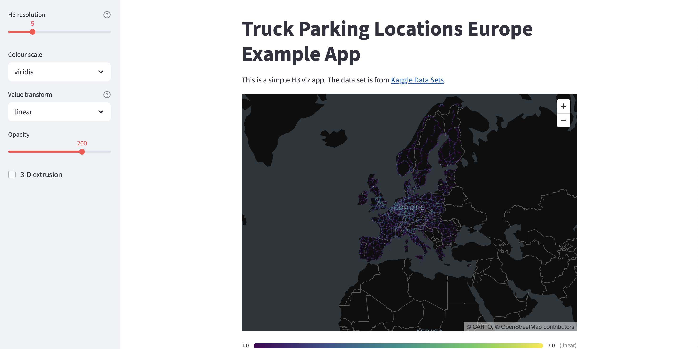

# 🚛 Truck Parking Locations Europe — H3 Viz App

An interactive Streamlit application that visualises European truck parking locations as H3 hexagonal heatmaps, powered by the custom [`streamlit-hexviz`](https://pypi.org/project/streamlit-hexviz/) package.




---

## ✨ Features

- **H3 hexagonal binning** — aggregates raw GPS points into hexagons at configurable resolutions (1–15)
- **Sidebar controls** — adjust resolution, colour scale, value transform, opacity, and 3-D extrusion on the fly
- **Multiple colour scales** — viridis, plasma, inferno, magma, and more
- **Linear / log value transform** — handle skewed distributions without pre-processing
- **3-D extrusion mode** — lift hexagons by count for an extra depth dimension
- **Zero boilerplate** — a single function call renders the full interactive map

---

## 📦 Installation

```bash
pip install streamlit streamlit-hexviz pandas
```

> **Python ≥ 3.9** and **Streamlit ≥ 1.30** are recommended.

---

## 🗂️ Dataset

The app uses the **European Truck Parking Locations** dataset from Kaggle:

📎 [https://www.kaggle.com/datasets/mexwell/european-truck-parking-locations](https://www.kaggle.com/datasets/mexwell/european-truck-parking-locations)

Download the CSV and place it in the project root:

```
data/
└── truck_parking_europe.csv
```

---

## 🚀 Running the app

```bash
streamlit run app.py
```

The app will open automatically in your browser.

---

## 🧩 Core code

```python
import streamlit as st
import pandas as pd
import streamlit_hexviz as shv

st.title("Truck Parking Locations Europe")
st.write("This is a simple H3 viz app. The data set is from [Kaggle Data Sets](https://www.kaggle.com/datasets/mexwell/european-truck-parking-locations).")

@st.cache_data
def load_data():
    return pd.read_csv("data/truck_parking_europe.csv", delimiter=';')

df = load_data()

shv.h3_map(df, lat="lat", lon="lon",
           resolution=3, use_sidebar_controls=True)
```

---

## 🎛️ Controls reference

| Control | Description | Default |
|---|---|---|
| **H3 resolution** | Hexagon size — higher = smaller cells | `5` |
| **Colour scale** | Matplotlib-compatible colour map | `viridis` |
| **Value transform** | `linear` or `log` scaling of counts | `linear` |
| **Opacity** | Fill opacity (0 – 255) | `200` |
| **3-D extrusion** | Extrude hexagons by count value | off |

---

## 📁 Project structure

```
.
data/
└── truck_parking_europe.csv
├── app.py                      # Streamlit application entry point
├── requirements.txt
└── README.md
```

---

## 📄 requirements.txt

```
streamlit>=1.30
streamlit-hexviz
pandas
```

---

## 🤝 Acknowledgements

- Dataset: [mexwell on Kaggle](https://www.kaggle.com/datasets/mexwell/european-truck-parking-locations)
- Map tiles: © [CARTO](https://carto.com/), © [OpenStreetMap](https://www.openstreetmap.org/copyright) contributors
- H3 library: [Uber H3](https://h3geo.org/)

---

## 📝 License

Apache License 2.0
